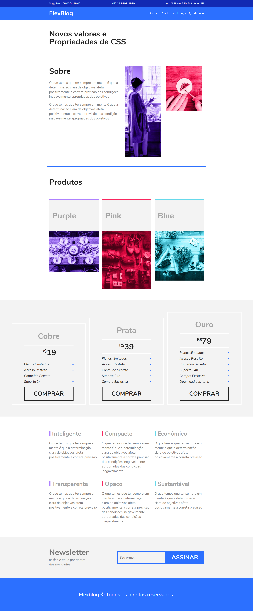
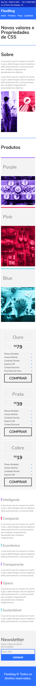

# Projeto Flexblog
Site fictício "Flexblog", desenvolvido com o intuito de consolidar conhecimentos em flexbox, ferramenta muito útil para responsividade e adaptação flexível dos elementos de um layout.
## Versão Desktop
---

## Versão Mobile
---

